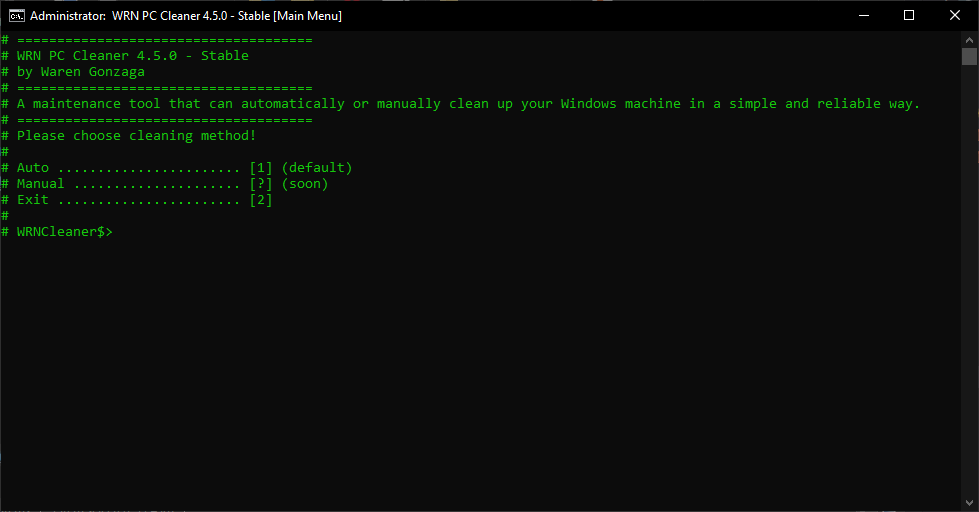

# WRN Cleaner 

   

---

A maintenance tool that can automatically or manually clean up your Windows machine in a simple and reliable way. It is designed specifically for Windows machine only. The motivation behind this project is to clean up Windows machine in an automated way with pre-configured optimization techniques. 😉💻🧹

## ⚡ Features

- Defragment (HDD)
- Retrim (SSD)
- DiskClean
- Windows Error Log Cleaner
- Recycle Bin Cleaner
- Clean Temp Folder
- Clean Prefetch Folder
- System File Checker
- Auto Shutdown and Reboot When Done

## 🕹️ Usage

Download the repository and look for **``"wrn_cleaner-vX.X.X.bat"``** file and open it and run as administrator. All you have to do is to follow the on-screen instructions.

Learn more: _[docs.warengonzaga.com/wrn-cleaner](https://docs.warengonzaga.com/wrn-cleaner)_

## 🎯 Contributing

Contributions are welcome, create a pull request to this repo and I will review your code. Please consider to submit your pull request to the `dev` branch. Thank you!

Read the project's [contributing guide](./CONTRIBUTING.md) for more info.

## 🐛 Issues

Please report any issues and bugs by [creating a new issue here](https://github.com/warengonzaga/wrn-cleaner/issues/new/choose), also make sure you're reporting an issue that doesn't exist. Any help to improve the project would be appreciated. Thanks! 🙏✨

## 🍀 Sponsors and Supporters

> Love what I do? Send me some [love](https://github.com/sponsors/warengonzaga) or [coffee](https://buymeacoff.ee/warengonzaga)!? 💖☕
>
> Can't send love or coffees? 😥 Nominate me for a **[GitHub Star](https://stars.github.com/nominate)** instead!
> Your support will help me to continue working on open-source projects like this. 🙏😇

## 📋 Code of Conduct

Read the project's [code of conduct](./CODE_OF_CONDUCT.md).

## 📃 License

WRN Cleaner is licensed under [GNU General Public License v3](https://opensource.org/licenses/GPL-3.0).

## 📝 Author

WRN Cleaner is created by **[Waren Gonzaga](https://github.com/warengonzaga)**, with the help of awesome [contributors](https://github.com/warengonzaga/wrn-cleaner/graphs/contributors).

---

💻💖☕ by [Waren Gonzaga](https://warengonzaga.com) | [YHWH](https://youtu.be/HHrxS4diLew?t=44) 🙏
